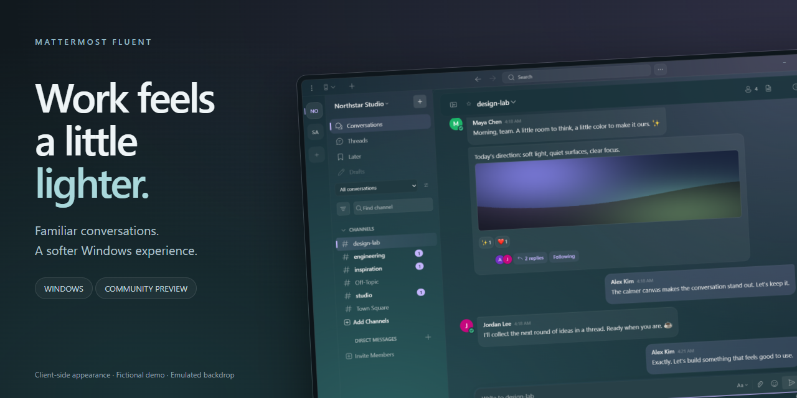
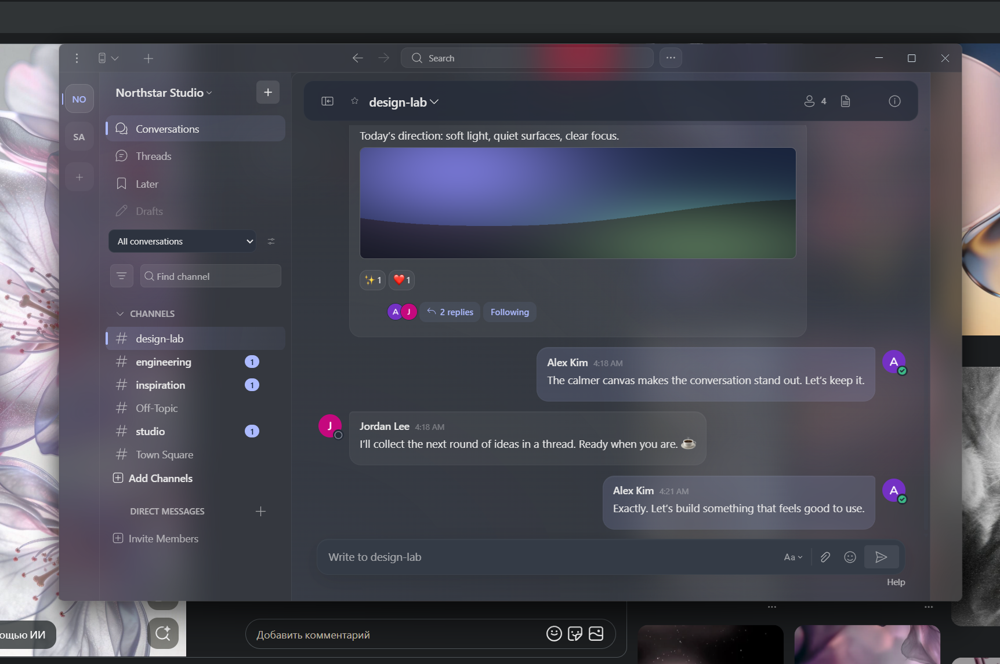
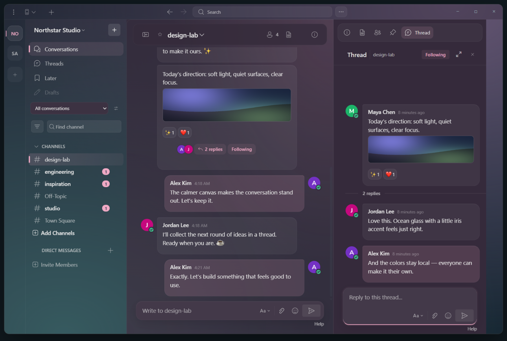
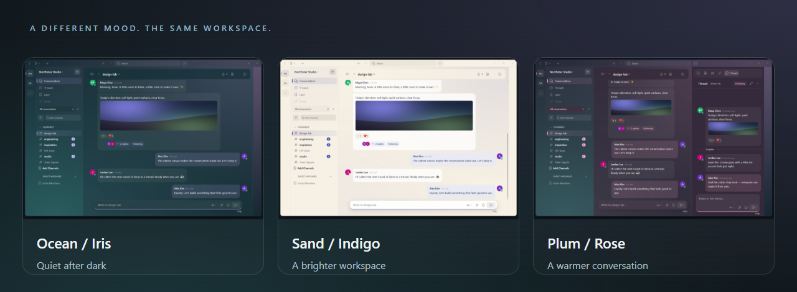
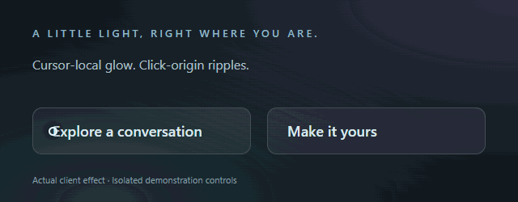

<p align="center">
  
</p>

<p align="center">
  <a href="https://github.com/Shightrox/mattermost-fluent/releases/tag/v6.3.0-fluent.32"></a>
  
  <a href="LICENSE.txt"></a>
</p>

<p align="center">
  <strong>A Fluent-inspired Mattermost client for Windows.</strong><br>
  Glass surfaces, calmer conversations, and colors that stay on your device.
</p>

<p align="center">
  <a href="https://github.com/Shightrox/mattermost-fluent/releases/download/v6.3.0-fluent.32/mattermost-fluent-6.3.0-fluent.32-windows-x64-setup.exe"></a>
  &nbsp;
  <a href="https://github.com/Shightrox/mattermost-fluent/releases/download/v6.3.0-fluent.32/mattermost-fluent-6.3.0-fluent.32-win-x64.zip"></a>
</p>

<p align="center">
  <a href="https://github.com/Shightrox/mattermost-fluent/releases/tag/v6.3.0-fluent.32">Release notes &amp; checksums</a> · <a href="#your-workspace-your-colors">Explore the themes</a> · <a href="docs/ROADMAP.md">Roadmap</a><br>
  <sub>Unsigned community preview · Windows x64 · Not an official Mattermost product</sub>
</p>

## Familiar work. Softer surroundings.

Your existing Mattermost server, with a local presentation layer. Mica, Acrylic or solid surfaces; a quieter sidebar and room for the conversation. No server-side theme installation required.



<p align="center"><sub>Real Windows capture · Fictional demo workspace · The website behind the window is intentionally visible to show Acrylic transparency.</sub></p>

## Keep the context close

Message bubbles, attachment galleries and reactions, with threads beside the conversation. Dedicated navigation keeps conversations, saved messages and drafts within reach.



## Your workspace, your colors

**Six window tints. Eight independent accents.** Light or dark, with adjustable chat background density. Choose a mood and keep it local.



<p align="center">
  <a href="docs/images/showcase-dark.png">Ocean / Iris</a> &nbsp; · &nbsp; <a href="docs/images/showcase-light.png">Sand / Indigo</a> &nbsp; · &nbsp; <a href="docs/images/showcase-thread.png">Plum / Rose</a> &nbsp; · &nbsp; <a href="docs/images/palettes.png">All tint and accent families</a>
</p>

## A little light, right where you are

Highlights follow the cursor. Soft ripples start where you click. Effects stop at rest and respect reduced motion and the **Smooth motion** setting.

<p align="center">
  
</p>

<p align="center"><sub>Actual client effect on isolated demonstration controls. The GIF is not a frame-rate benchmark.</sub></p>

---

All chat content uses **fictional people and messages**. The Acrylic scene above is a real desktop screenshot; the other showcase compositions use production renderer captures with an emulated backdrop. [How the showcase was made](docs/SHOWCASE.md).

<details>
<summary><strong>Installation &amp; preview limitations</strong></summary>

Download the setup executable for guided installation, or extract the entire ZIP and run **Mattermost Fluent.exe**. Both use `%APPDATA%/Mattermost Fluent`; the ZIP does not carry a separate portable profile. Quit Fluent before replacing its files.

- Preview **32**, based on Mattermost Desktop 6.3. Native Mica/Acrylic requires Windows 11 22H2 or later and suitable system settings; solid surfaces provide a fallback.
- Builds are unsigned, so Windows may display an unknown-publisher or SmartScreen warning.
- History-loading stalls remain. No universal performance improvement is claimed.
- The adapter depends on server web-app markup; compatibility across all server versions and plugins is not yet verified.
- macOS and Linux are inherited from upstream but are not validated Fluent targets.
- Upstream binary updates are disabled. Install preview updates manually.

[Release notes](https://github.com/Shightrox/mattermost-fluent/releases/tag/v6.3.0-fluent.32) · [Validation](docs/VALIDATION.md) · [Release roadmap](docs/ROADMAP.md)

</details>

<details>
<summary><strong>Build &amp; contribute</strong></summary>

Use the Node.js version in `.nvmrc`. On Windows x64, `npm run setup:windows` prepares verified native dependencies without the optional Visual Studio ATL component. With normal native build tools installed:

```sh
npm ci
npm run build-prod
npm start
```

`npm run package:fluent` creates the installer and ZIP. Use `npm run watch` for development, `npm run check` for code checks and `npm run test:fluent` for the synthetic UI fixture.

Localhost fixtures and generated sessions belong in ignored `artifacts/`. Never reuse fixture credentials for a real service.

[Contribution guide](CONTRIBUTING.md) · [Report an issue](https://github.com/Shightrox/mattermost-fluent/issues/new/choose) · [Security reporting](SECURITY.md)

</details>

<details>
<summary><strong>Credits &amp; license</strong></summary>

Based on [Mattermost Desktop](https://github.com/mattermost/desktop), originally created as electron-mattermost by Yuya Ochiai. Inspired by Fluent design and the restrained visual direction of Fluenty for Steam. This fork is not an official Mattermost or Microsoft product.

[Apache 2.0 license](LICENSE.txt) · [Notices](NOTICE.txt) · [Fluent icon notices](NOTICE-Fluent-Icons.txt) · [Source provenance](CONTRIBUTING.md#source-provenance)

</details>
