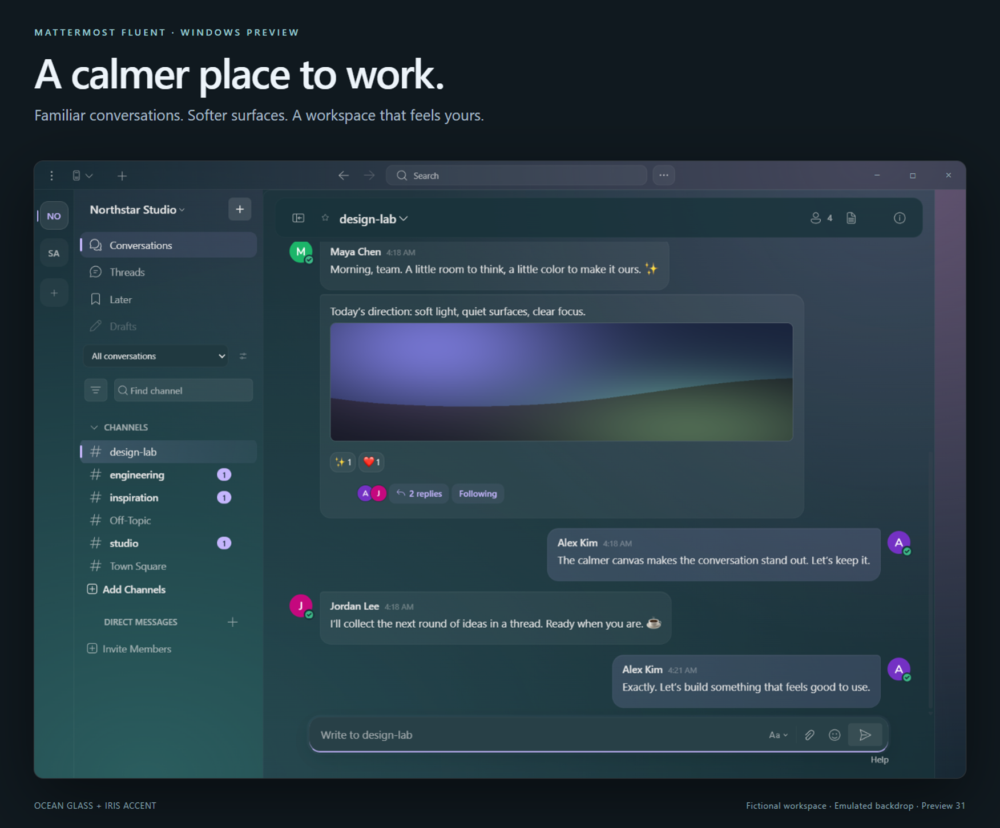
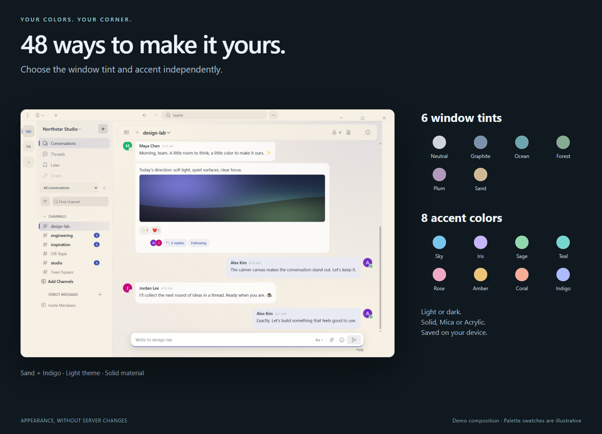

# Mattermost Fluent

A personal Fluent-inspired Mattermost desktop experience for Windows. Glass surfaces, calmer conversations and colors that stay on your device.

**Unofficial community fork · Windows preview · Client-side appearance**

[**Download Windows preview — installer or ZIP**](https://github.com/Shightrox/mattermost-fluent/releases/tag/v6.3.0-fluent.31)

Windows x64. Preview builds are unsigned; see the release notes for installation instructions, checksums and known limitations. The ZIP uses the normal application profile, not a portable profile stored beside the executable.



Built on [Mattermost Desktop](https://github.com/mattermost/desktop). The client loads your server's web app and adds a local presentation layer. No server-side theme installation is required.

## Make it yours

Six window tints and eight independent accents. Choose light or dark, adjust the chat background density, and use solid surfaces, Mica or Acrylic where supported.



## Keep the conversation close

Message bubbles, attachment galleries, reactions and a contextual thread panel. Conversations, threads, saved messages and drafts have dedicated navigation; local collections and focus mode help organize your workspace.


Cursor-local highlights and click-origin ripples add gentle feedback to controls. Effects stop at rest and respect reduced motion and the **Smooth motion** setting.

All images use **fictional accounts and messages from an isolated localhost demo**. The artwork combines actual production-renderer captures with an **emulated backdrop** and presentation framing. [Image provenance and reproduction](docs/SHOWCASE.md).

[Dark view](docs/images/showcase-dark.png) · [Light view](docs/images/showcase-light.png) · [Thread view](docs/images/showcase-thread.png)

## Preview status

Current source preview: **31**, based on the Mattermost Desktop 6.3 code line. Windows is the actively tested target. Native Mica/Acrylic requires Windows 11 22H2 or later and suitable system settings; solid surfaces provide a fallback.

- Some history-loading stalls remain. No blanket FPS or performance improvement is claimed.
- The adapter depends on recognizable server web-app markup. Compatibility across every server version and plugin is not yet verified.
- macOS and Linux are inherited from upstream but are not validated Fluent release targets.
- Upstream binary update notifications are disabled for this fork.

See the [release checklist](docs/ROADMAP.md) and [latest review](docs/VALIDATION.md) for limitations and validation results.

## Build locally

Use the Node.js version specified by the repository. Windows x64 users can run `npm run setup:windows` instead of `npm ci` to prepare the verified native dependencies without the optional Visual Studio ATL component:

```sh
npm ci
npm run build-prod
npm start
```

Create the Windows preview package with `npm run package:fluent`. For development, use `npm run watch`; run `npm run check` and `npm run test:fluent` for validation.

Optional localhost integration fixtures live in `scripts/`. Generated sessions and tokens belong in the ignored `artifacts/` directory. Demo credentials in fixture scripts are synthetic and must not be reused for a real service.

## Credits and license

Based on Mattermost Desktop, originally created as electron-mattermost by Yuya Ochiai. Inspired by Fluent design and the restrained visual direction of Fluenty for Steam. This fork is not an official Mattermost or Microsoft product.

See [LICENSE.txt](LICENSE.txt), [NOTICE.txt](NOTICE.txt) and [Fluent icon notices](NOTICE-Fluent-Icons.txt). Upstream development documentation is available in the [Mattermost developer guide](https://developers.mattermost.com/contribute/desktop/).

## Contribute

[Report a bug](https://github.com/Shightrox/mattermost-fluent/issues/new/choose) · [Contribution guide](CONTRIBUTING.md) · [Source provenance](docs/PROVENANCE.md) · [Security reporting](SECURITY.md)
